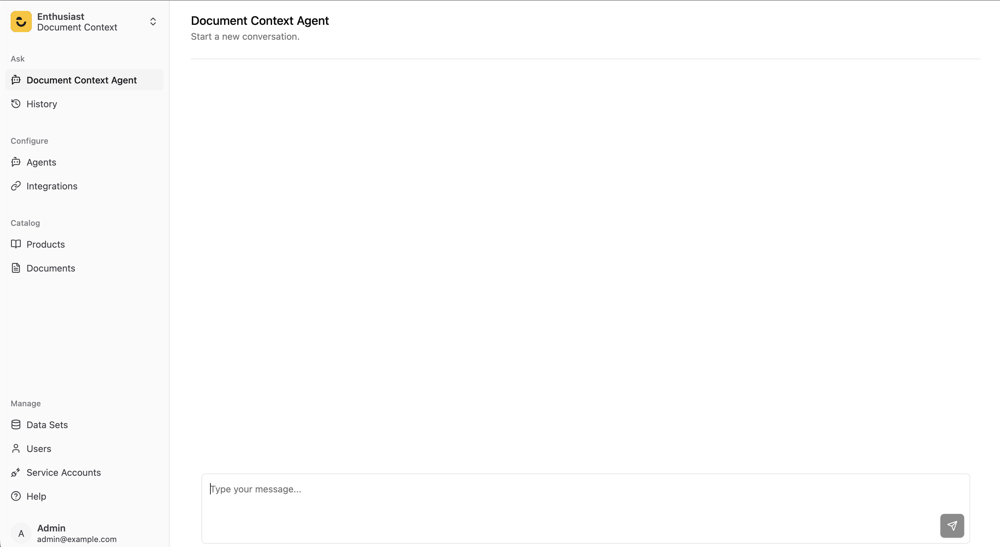

# Creating custom Agent
Custom Agent will allow to customize any part of agent providing its configuration, while enthusiast take care of building it.

## Creating a simple Document Context Agent - which will answer questions about documents.

### Proposed folder structure

```
document_context_agent/
├── __init__.py
├── agent.py
├── config.py
├── prompt.py
└── tools/
    ├── __init__.py
    └── document_context_tool.py
```

1. Create a directory for you agent (e.g. `document_context_agent`). Then inside it create `agent.py` file:
```python
from enthusiast_agent_tool_calling import BaseToolCallingAgent
from enthusiast_common.config.base import LLMToolConfig

from .tools import ContextSearchTool

class ExampleDocumentContextAgent(BaseToolCallingAgent):
    AGENT_KEY = "enthusiast-agent-example-document-context"
    NAME = "Example Document Context Agent"
    
    TOOLS = [LLMToolConfig(tool_class=ContextSearchTool)]
```
2. Create Prompt in prompt.py file.
```python
DOCUMENT_CONTEXT_AGENT_SYSTEM_PROMPT="""
You are a helpful agent, answering questions about documents and resources mentioned in them.

Whenever the user asks a question — whether about a document itself or about a resource, topic, or entity mentioned in a document — always use the document context tool first to extract relevant context. Do not ask the user for details that the tool can retrieve; use it proactively to gather the necessary information before answering.
"""
```

3. Create context retrieving tool:
```python
from enthusiast_common.injectors import BaseInjector
from enthusiast_common.tools import BaseLLMTool
from langchain_core.language_models import BaseLanguageModel
from pydantic import BaseModel, Field


class ContextSearchToolInput(BaseModel):
    full_user_request: str = Field(description="user's full request")


class ContextSearchTool(BaseLLMTool):
    NAME = "context_search_tool"
    DESCRIPTION = "Use it to get context from documents required for answering questions"
    ARGS_SCHEMA = ContextSearchToolInput
    RETURN_DIRECT = False

    def __init__(
        self,
        data_set_id: int,
        llm: BaseLanguageModel,
        injector: BaseInjector,
    ):
        super().__init__(data_set_id=data_set_id, llm=llm, injector=injector)
        self.data_set_id = data_set_id
        self.llm = llm
        self.injector = injector

    def run(self, full_user_request: str):
        document_retriever = self.injector.document_retriever
        relevant_documents = document_retriever.find_content_matching_query(full_user_request)
        content  = [document.content for document in relevant_documents]

        return content
```

4. Create `tools/__init__.py` to expose the tool:
```python
from .document_context_tool import ContextSearchTool

__all__ = ["ContextSearchTool"]
```

5. Create configuration inside `config.py` file:
```python
from enthusiast_common.config import AgentConfigWithDefaults
from enthusiast_common.config.prompts import ChatPromptTemplateConfig, Message, MessageRole

from .agent import ExampleDocumentContextAgent
from .prompt import DOCUMENT_CONTEXT_AGENT_SYSTEM_PROMPT


def get_config() -> AgentConfigWithDefaults:
    return AgentConfigWithDefaults(
        prompt_template=ChatPromptTemplateConfig(
            messages=[
                Message(
                    role=MessageRole.SYSTEM,
                    content=DOCUMENT_CONTEXT_AGENT_SYSTEM_PROMPT,
                ),
                Message(role=MessageRole.PLACEHOLDER, content="{chat_history}"),
                Message(role=MessageRole.USER, content="{input}"),
                Message(role=MessageRole.PLACEHOLDER, content="{agent_scratchpad}"),
            ]
        ),
        agent_class=ExampleDocumentContextAgent,
        tools=ExampleDocumentContextAgent.TOOLS,
    )
```
6. Ensure your agent is available for import from directly your agent directory:
```python
# document_context_agent/__init__.py
from .agent import ExampleDocumentContextAgent

__all__ = ["ExampleDocumentContextAgent"]
```
7. Finally add your agent to `settings_override.py`:
```python
AVAILABLE_AGENTS = ['document_context_agent.ExampleDocumentContextAgent']
```
Now Agent is available in UI to chat with it.



